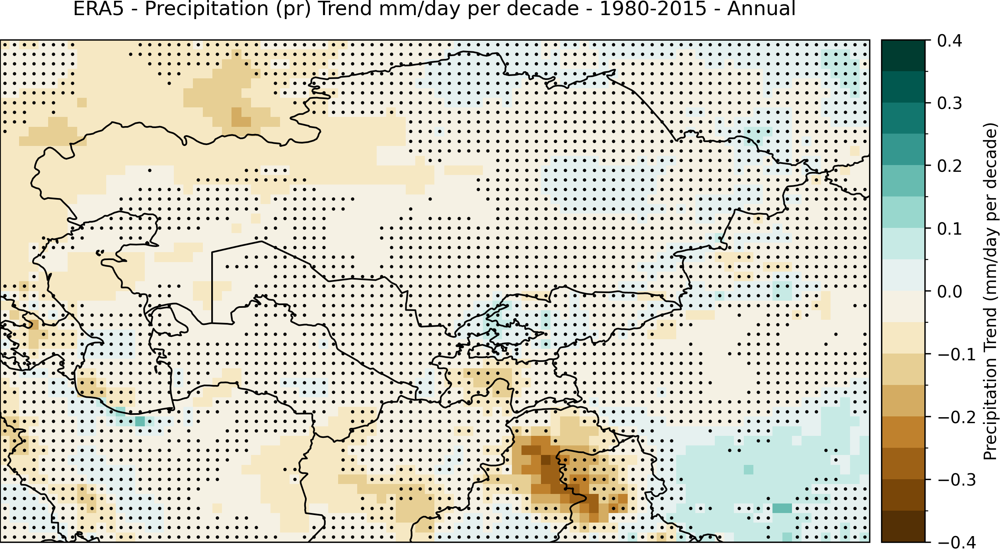
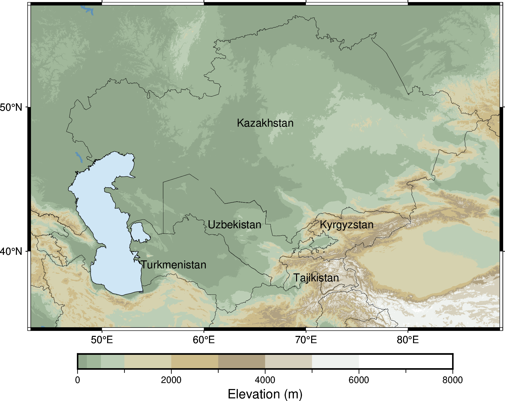

# IPCC Atlas NetCDF Plotting Tools

This repository contains Python scripts for visualizing climate data derived from NetCDF files downloaded from the IPCC Atlas. The tools focus on plotting precipitation, temperature, and snow anomaly trends over Central Asia, utilizing datasets processed with specific warming scenarios and statistical robustness thresholds.

## Features

- **Precipitation Trends**: Visualizes precipitation trends (mm/day per decade) with statistical significance masking.
- **Temperature Trends**: Visualizes mean temperature trends (°C per decade) with statistical significance masking.
- **Snow Anomaly Changes**: Plots snow anomalies (mm/day) under different SSP warming scenarios with robustness thresholds.

## Dependencies

The scripts require the following Python packages:

- `xarray` (for working with NetCDF data)
- `matplotlib` (for plotting)
- `numpy` (for numerical operations)
- `cartopy` (for geographic projections and features)
- `mpl_toolkits.axes_grid1` (for enhanced colorbar placement)

You can install these dependencies via pip:

```bash
pip install xarray matplotlib numpy cartopy
```

## Scripts Overview

### 1. **`pr.py`**
   - **Description**: Visualizes precipitation trends over Central Asia for the period 1980–2015.
   - **Output**: Saves a map (`precipitation_trend_central_asia.png`) highlighting significant trends and masks areas with a p-value above the threshold.
   - **Key Parameters**:
     - **Data**: Precipitation trend (`pr_trend`) and p-value (`pr_trend_pvalue`).
     - **Threshold**: 0.10 for significance.

### 2. **`plot_figur_temp.py`**
   - **Description**: Visualizes mean temperature trends over Central Asia for the period 1980–2015.
   - **Output**: Saves a map (`temperature_trend_central_asia.png`) highlighting significant trends and masks areas with a p-value above the threshold.
   - **Key Parameters**:
     - **Data**: Temperature trend (`tas_trend`) and p-value (`tas_trend_pvalue`).
     - **Threshold**: 0.10 for significance.

### 3. **`snow.py`**
   - **Description**: Plots snow anomaly changes for different SSP warming scenarios using robustness thresholds.
   - **Output**: Saves maps for various scenarios:
     - **SSP5-8.5 (4°C warming)**: `snow_anomaly_central_asia_ssp5_8_5_4C_with_robustness.png`
     - **SSP3-7.0 (3°C warming)**: `snow_anomaly_central_asia_ssp3_7_0_3C_with_robustness.png`
     - **SSP2-4.5 (2°C warming)**: `snow_anomaly_central_asia_ssp2_4_5_2C_with_robustness.png`
   - **Key Parameters**:
     - **Data**: Snow anomaly (`prsn_anom`) and robustness (`prsn_anom_robustness`).
     - **Threshold**: 0.7 for robustness.

## Example Usage

Run the scripts directly after ensuring the required NetCDF files are in the expected directories. 

### Example Commands:

1. **Precipitation Trends**:
   ```bash
   python pr.py
   ```

2. **Temperature Trends**:
   ```bash
   python plot_figur_temp.py
   ```

3. **Snow Anomaly Changes**:
   ```bash
   python snow.py
   ```

## File Structure

- **Data Files**:
  - `pr/map.nc` and `pr/pvalue.nc`: Input data for precipitation trends.
  - `tas/map.nc` and `tas/pvalue.nc`: Input data for temperature trends.
  - `snow_*/map.nc` and `snow_*/robustness.nc`: Input data for snow anomalies under different SSP scenarios.

- **Output Files**:
  - `precipitation_trend_central_asia.png`
  - `temperature_trend_central_asia.png`
  - Snow anomaly maps for each SSP scenario.

## Visualization Example

Below is an example of the precipitation trend plot and the topography:



---

## License

This project is licensed under the MIT License. See the [LICENSE](LICENSE) file for details.

## Contributing

Contributions are welcome! Please open an issue or submit a pull request.
